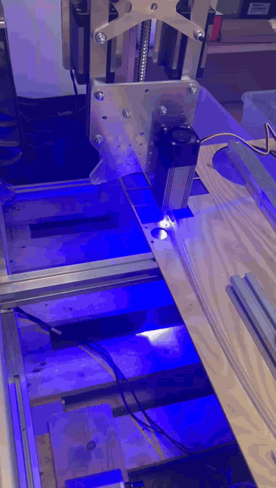
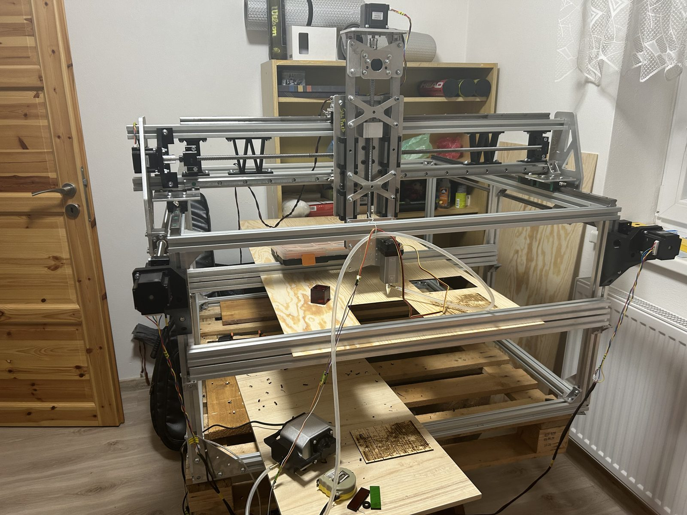
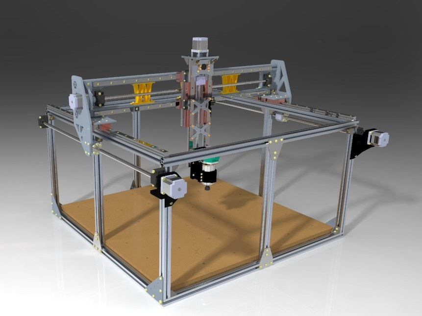
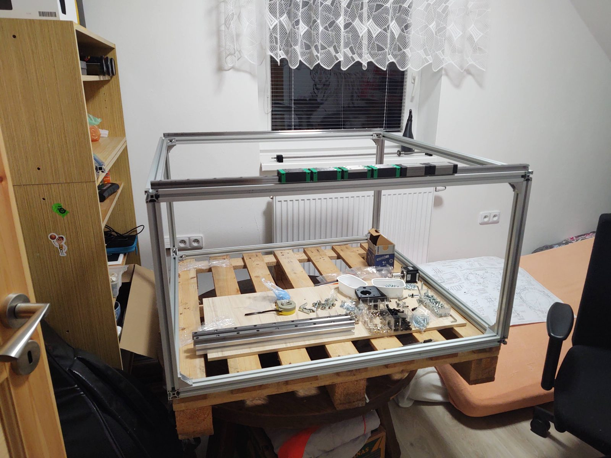
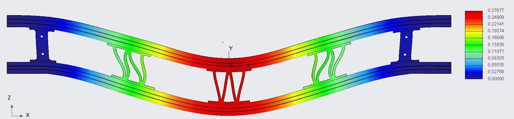
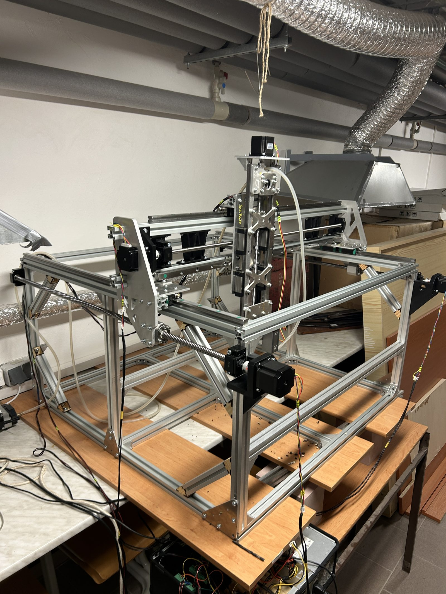
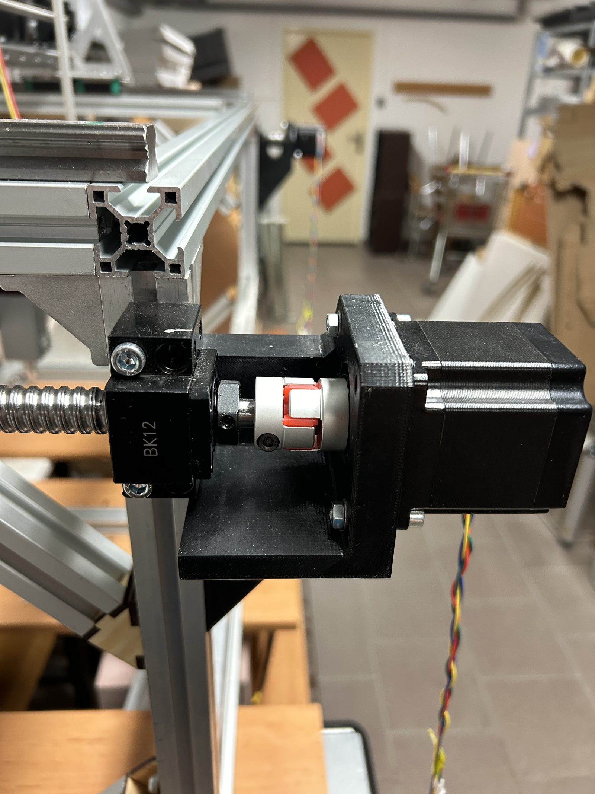
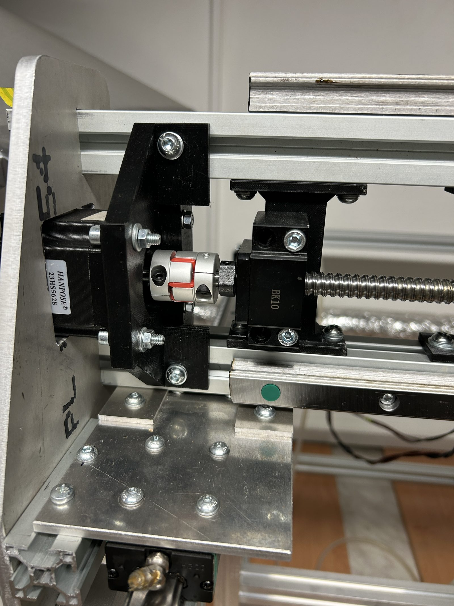
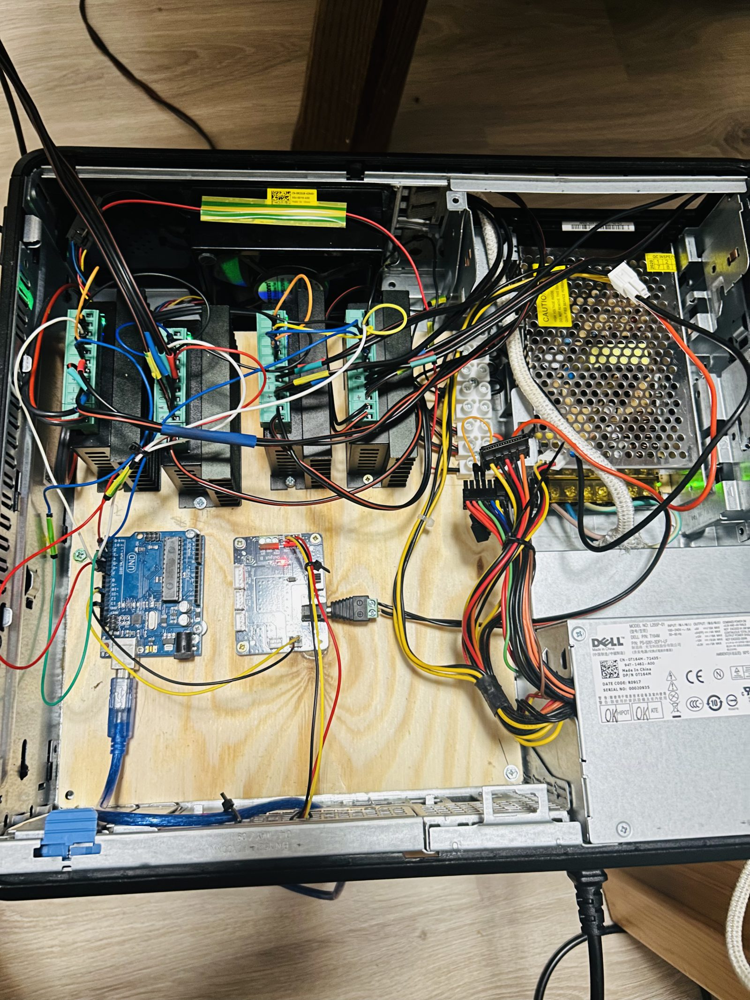

# Open-source 3-axis CNC machine

*The machine running a 10 W diode laser, cutting plywood with air assist. ([full clip](images/laser-cutting.mp4))*

A three-axis CNC machine I designed as my bachelor's thesis in 2022 and then built,
wired and commissioned over the following two years. Frame concept, FEA sizing,
component selection, procurement, assembly and GRBL setup are all my own work,
done in free time on a hobby budget.

Designed as a router, it was commissioned and actually run with a 10 W diode laser
head — that is the configuration I validated in practice, cutting plywood up to
10 mm in multiple passes with relay-switched air assist. The Makita router was
physically fitted but never wired for control (that would have meant taking the tool
apart to tap its electronics, a risk I chose not to take), so the machine was never
taken to milling, and positioning accuracy was never measured against a reference —
I make no claim to milling tolerances. What the project demonstrates is the full
engineering loop — concept, calculation, drawings, procurement, build, control, and
a working machine that cuts.

*As designed in Creo — the full assembly the build was worked out from.*

## Specification

| | |
|---|---|
| Working envelope | 750 × 830 × 400 mm |
| Overall dimensions | 1710 × 1150 × 1200 mm |
| Frame | Aluminium extrusion 3030, Al6060 T5, T-nut assembly |
| Linear guides | HIWIN HGR20 rails, HGH20CA blocks (all axes), ZA preload |
| Drive | HIWIN ballscrews, 5 mm pitch — R1605 (X, Y), R1205 (Z) |
| Motors | NEMA 23 stepper, 1.4 Nm up to ~70 rpm |
| Resolution | 320 steps/mm at 1/8 microstepping |
| Max feed rate | 1000 mm/min (at 200 rpm, torque preserved) |
| Head — run | 10 W diode laser, with compressor air assist switched by a relay |
| Head — fitted | Makita RT0700C router, 710 W — mounted in a printed holder, never wired for control |
| Max cutting force | 1397 N (calculated, routing design case) |
| Control | Arduino Uno, GRBL, TB6600 drivers |
| Table | Hardwood plywood |
| Materials cut (laser) | Plywood — up to 10 mm in multiple passes; 3 mm spruce ply the routine case |

## Design notes

**Aluminium extrusion over a welded steel frame.** Steel is cheaper per metre, but
a welded frame distorts as it cools and the weight itself contributes to
deflection. Extrusion is lighter, stays square, and — the reason that mattered
most for a first machine — lets any element be swapped for a better one later
without cutting anything apart.

<!-- 02 — DOPLNIT: sestavený rám z profilů 3030, ať je vidět T-drážkové spojení. -->

**Sizing the frame by simulation, not by feel.** The gantry load was taken as
400 N (~40 kg split across two rails) and the beam simulated in Creo Simulate.
Supported only at its ends, the profile deflected about 1 mm — far too much. Adding
a single vertical strut at mid-span cut that to 0.14 mm, roughly a factor of ten
for one extra profile. Simulating the profile together with the steel linear rail,
which carries load as a structural member rather than just riding on top, brought
it to 0.027 mm. The lesson worth taking from this: the cheapest stiffness on the
whole machine came from one strut in the right place.

*Gantry deflection in Creo Simulate (deformation exaggerated) — the mid-span strut
is the small truss at the centre.*

<!-- 04 — DOPLNIT: reálná fotka gantry nosníku s tou jednou vzpěrou uprostřed. -->

**Where 3D printing belongs and where it doesn't.** Printed PET-G is fine for
motor mounts, endstop brackets and covers. It is not fine for anything holding
geometry under dynamic load — plastic is too elastic, and once the motors run,
the accelerating masses turn that compliance into position error. Those parts are
waterjet-cut from 3 mm aluminium plate instead. Printed parts also fail between
layers when loaded perpendicular to them, so print orientation was part of the
design, not an afterthought (PET-G, 0.2 mm layers, 30 % infill, Prusa i3 MK2.5S).

<!-- 05 — hotovo (IMG_3344): tištěný PET-G držák motoru. -->
<!-- Máš-li čistý záběr waterjet dílu z 3mm hliníku, přidej jako druhý obrázek. -->

**Ballscrews over belts.** More expensive, but they give backlash under 0.05 mm
and a high enough lead that the required motor torque drops — 0.018 Nm to move
the Y axis, well inside what a NEMA 23 delivers.

<!-- 06 — DOPLNIT: detail kuličkového šroubu + lineárního vedení HIWIN (tyč a blok). -->

**Modular Z head.** The head attaches with six bolts to an aluminium plate, so the
router spindle can be swapped for a laser or a 3D printing extruder without touching
the rest of the axis. This is not a hypothetical: the machine was actually
commissioned with a 10 W diode laser bolted to that plate, and that is the head that
ran. The modular mount is what made running the machine as a laser a bolt-on job
rather than a redesign.

<!-- 07 — CHYBÍ FOTKA: detail Z-hlavy s osazeným laserem (modulární deska, 6 šroubů).
Titulní fotka 01 laser ukazuje z dálky; detail by sedl sem. Až ho dodáš, ulož jako
images/07-zhead.jpg a odkomentuj řádek níž. -->
<!--  -->

**Control and electronics.** An Arduino Uno running GRBL drives three TB6600
stepper drivers. Nothing exotic — the point was a controller anyone can source and
reflash, not a proprietary box. The laser runs off GRBL's PWM output for power
control, and the compressor air assist is switched by a relay off the same
controller, so the whole head — motion, laser power, air — is driven from one
G-code stream.

<!-- 08 — DOPLNIT: elektronika — Arduino Mega + TB6600 drivery v rozvaděči, zapojení. -->

**What I'd change, and the honest gaps.** The structure is overbuilt relative to the
motors — it was sized for masses well above the actual ones to leave room for later
upgrades, and the result is a machine whose speed is limited by the drives rather
than by stiffness. The Z-axis support deflects 0.115 mm at 100 N, the largest number
on the machine and the first thing I'd stiffen. Two gaps I don't paper over: the
routing spindle was designed but the machine was never taken to actual milling, and
positioning accuracy was never measured against a reference. The laser configuration
is what proved the machine could be built, wired and driven end to end.

## Thesis

Návrh konstrukce open-source CNC frézky (2022), Technical University of Liberec,
Faculty of Mechanical Engineering. Supervisor: Ing. Andrii Shynkarenko, Ph.D.

---

[← zpět na přehled projektů](../README.md)
